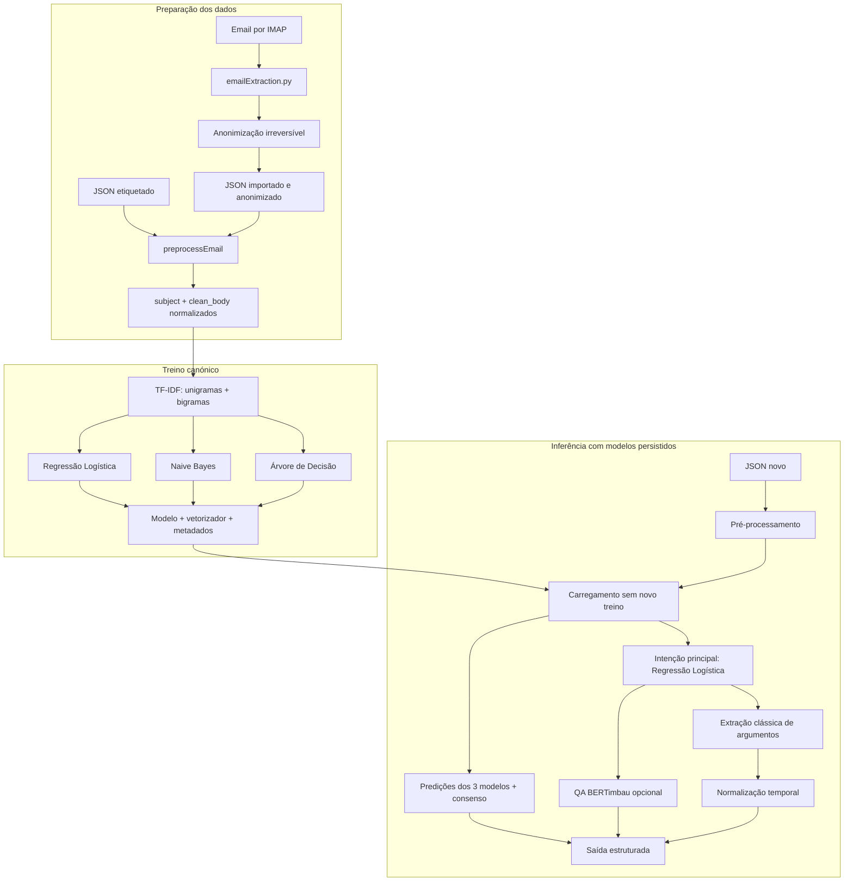

# Email Recognition PT-PT

Pipeline de investigação para classificar a intenção de emails em português europeu e extrair informação estruturada sobre reuniões. O projeto compara três classificadores clássicos — Regressão Logística, Naive Bayes Multinomial e Árvore de Decisão — sobre representações TF-IDF, e inclui anonimização, extração de argumentos, normalização temporal e uma alternativa experimental de *question answering* (QA) com BERTimbau.

> **Estado do projeto:** protótipo académico. A maior parte dos dados incluídos é sintética; modelos treinados, emails importados e resultados de execução são artefactos locais. As métricas produzidas em divisões aleatórias dos datasets sintéticos não devem ser interpretadas como desempenho em emails reais.

## Objetivos

- Importar emails por IMAP e guardar apenas a representação anonimizada.
- Classificar cada email numa de quatro intenções.
- Comparar os classificadores sob o mesmo protocolo de pré-processamento e avaliação.
- Extrair participantes, tempo, local e tópico por regras, spaCy e heurísticas.
- Normalizar expressões temporais relativamente à data de envio do email.
- Comparar a extração clássica com uma abordagem QA baseada em BERTimbau.
- Produzir artefactos auditáveis: metadados de treino, probabilidades, matrizes de confusão e análise de erros.

## Classes de intenção

| Label | Interpretação operacional |
|---|---|
| `agendamento_reuniao` | Pedido, proposta, negociação ou remarcação de uma reunião. |
| `cancelamento_reuniao` | Cancelamento, adiamento, indisponibilidade ou impossibilidade de comparecer. |
| `reuniao_confirmada` | Aceitação, confirmação de presença ou indicação de que a reunião ficou marcada. |
| `nao_reuniao` | Email cujo objetivo principal não é marcar, cancelar ou confirmar uma reunião. |

O fluxo canónico de treino exige que as quatro classes estejam presentes no dataset. Scripts mais antigos em `models/` podem usar contratos ou conjuntos de classes anteriores e são mantidos sobretudo por compatibilidade e histórico experimental.

## Arquitetura atual



Cada classificador mantém o seu próprio vetorizador TF-IDF. No runner principal, a intenção operacional é a previsão da Regressão Logística; as três previsões e o consenso por maioria também são guardados. A extração clássica recebe essa intenção como contexto e é executada sobre todos os emails processados, incluindo os classificados como `nao_reuniao`.

O `TriggerExtractor` existe e é usado pelos pipelines programáticos em `preprocessing/email_pipeline*.py` e por utilitários de anotação. Contudo, o CLI canónico `run_project.py` não o liga atualmente à saída principal: executa a classificação, a extração de argumentos e a normalização temporal.

## Pontos de entrada

| Comando | Função | Treina modelos? | Entrada principal | Saída por omissão |
|---|---|---:|---|---|
| `emailExtraction.py` | Importação IMAP com anonimização imediata | Não | Conta IMAP | `dataset/imported_emails_anonymized.json` |
| `run_classification_models.py train` | Treino dos três classificadores no dataset completo | Sim | JSON etiquetado | `trained_models/email_intent/` |
| `run_classification_models.py evaluate` | Avaliação independente dos modelos persistidos | Não | JSON etiquetado independente | `evaluation_results/independent_classification/` |
| `run_project.py` | Inferência, extração clássica e QA local | Não | JSON etiquetado ou não etiquetado | `evaluation_results/project_runs/<dataset>/` |
| `run_project_evaluation.py` | Experiência integrada com divisão treino/teste e validação cruzada | Sim | JSON etiquetado | `evaluation_results/full_pipeline/` |

Para comparação científica final, deve preferir-se a separação explícita entre `train` e `evaluate`. O runner integrado é útil para exploração e diagnóstico, mas não substitui um conjunto de teste externo e congelado.

## Estrutura do repositório

```text
email_recognition_pt_pt/
├── emailExtraction.py                 # importação IMAP e anonimização
├── run_classification_models.py       # treino/avaliação canónicos
├── run_project.py                     # inferência com modelos persistidos
├── run_project_evaluation.py          # runner experimental integrado
├── models/
│   ├── logistic_regression_classifier.py
│   ├── naive_bayes_classifier.py
│   ├── decision_tree_classifier.py
│   ├── utils.py
│   └── train_*.py, predict_*.py        # scripts anteriores/específicos
├── preprocessing/
│   ├── anonymization.py               # orquestração híbrida
│   ├── regex_anonymizer.py
│   ├── ner_anonymizer.py
│   ├── preprocess.py                  # limpeza, frases, tokens e metadados
│   ├── trigger_extraction.py
│   ├── argument_extraction.py
│   └── temporal_normalization.py
├── dataset/                           # datasets sintéticos e conversores
├── gold_annotations/                  # geração, validação e pseudo-gold
├── evaluation/                        # métricas de extração e relatórios
├── qa/                                # BERTimbau QA e fine-tuning
├── guides/                            # documentação complementar
├── memory/                            # notas históricas do projeto
├── trained_models/                    # artefactos locais, ignorados pelo Git
└── evaluation_results/                # resultados gerados, em geral ignorados
```

O mapa técnico completo, os contratos de dados e as regras para uma IA trabalhar no projeto estão em [`AI_PROJECT_CONTEXT.md`](AI_PROJECT_CONTEXT.md).

## Instalação

O ambiente atualmente auditado usa Python 3.14.3. As dependências do pipeline clássico estão fixadas em `requirements.txt`.

```powershell
python -m venv .venv
.\.venv\Scripts\Activate.ps1
python -m pip install -r requirements.txt
```

Em Linux ou macOS, ative o ambiente com `source .venv/bin/activate`.

O módulo QA é opcional e tem dependências adicionais:

```powershell
python -m pip install -r qa/requirements_qa.txt
```

O primeiro uso de um checkpoint Hugging Face pode necessitar de acesso à Internet. A utilização de GPU depende de uma instalação do PyTorch compatível com a versão CUDA da máquina.

## Utilização

### 1. Importar e anonimizar emails

Crie `.env` a partir de `.env_example` e preencha:

```dotenv
SERVER="imap.gmail.com"
EMAIL="utilizador@dominio.pt"
PASSWORD="palavra-passe-de-aplicacao"
```

Depois execute, por exemplo:

```powershell
python emailExtraction.py --mailbox inbox --search ALL --limit 100
```

Opções disponíveis:

- `--output`: caminho do JSON de saída;
- `--mailbox`: pasta IMAP, por omissão `inbox`;
- `--search`: critério IMAP, por omissão `ALL`;
- `--limit`: máximo de mensagens;
- `--disable-spacy`: anonimização apenas com regras e expressões regulares.

A importação chama `EmailAnonymizer` antes de devolver ou persistir os emails, com `keep_mapping=False` e sem guardar texto original. O ficheiro `.env` e os ficheiros `dataset/imported_emails*.json` estão ignorados pelo Git.

### 2. Treinar os classificadores

```powershell
python run_classification_models.py train --dataset dataset/realistic_school_professional_10000.json --model-dir trained_models/email_intent --max-features 5000 --random-state 42
```

O treino usa todos os exemplos válidos, exige as quatro labels e grava, para cada modelo, o estimador e o vetorizador. Não cria uma divisão de teste interna.

### 3. Avaliar sem retreinar

```powershell
python run_classification_models.py evaluate --dataset caminho/para/teste_independente.json --model-dir trained_models/email_intent --output-dir evaluation_results/independent_classification
```

Antes da avaliação, o runner compara o SHA-256 do ficheiro e os *fingerprints* dos textos pré-processados com os metadados de treino. Por omissão, recusa o mesmo ficheiro, emails exatamente repetidos e labels desconhecidas. A opção `--allow-overlap` existe apenas para testes técnicos deliberados; não deve ser usada para resultados científicos.

### 4. Executar o projeto com modelos persistidos

```powershell
python run_project.py dataset/test_dataset.json
```

Este comando:

1. procura o bundle canónico em `trained_models/email_intent/` ou, em alternativa, o bundle mais recente com `training_metadata.json`;
2. pré-processa os emails sem voltar a anonimizá-los;
3. obtém previsões e probabilidades dos três classificadores sem chamar `fit`;
4. guarda a previsão principal, o consenso e os votos individuais;
5. executa a extração clássica e a normalização temporal;
6. tenta executar o modelo QA em `qa/models/bertimbau_qa_finetuned`.

Um clone limpo não contém um bundle canónico treinado nem os pesos QA; treine os classificadores antes de executar o projeto. Para preparar o diretório QA esperado:

```powershell
python qa/fine_tune_qa.py --train-file dataset/hf_qa_train_validation/train.jsonl --validation-file dataset/hf_qa_train_validation/validation.jsonl --output-dir qa/models/bertimbau_qa_finetuned
```

Se pretender executar apenas a parte clássica através da API Python:

```python
from pathlib import Path

from run_project import run_project

run_project(
    Path("dataset/test_dataset.json"),
    include_qa=False,
)
```

### 5. Executar uma experiência integrada

```powershell
python run_project_evaluation.py --dataset dataset/realistic_school_professional_10000.json --output-dir evaluation_results/full_pipeline --skip-anonymization
```

Por omissão, este runner usa uma divisão estratificada 80/20, `random_state=42`, até cinco folds de validação cruzada e 5000 features. As opções mais relevantes são `--skip-cv`, `--skip-argument-extraction`, `--gold-annotations`, `--run-qa`, `--qa-model`, `--qa-gold` e `--reference-datetime`.

Use `--skip-anonymization` apenas quando os dados já forem sintéticos ou estiverem anonimizados. Sem essa opção, a preparação experimental anonimiza os registos que ainda não contenham metadados de anonimização.

## Contratos de dados

### Dataset mínimo para classificação

O ficheiro é uma lista JSON. `subject` é opcional, mas pelo menos `subject` ou `body` deve conter texto; `label` é obrigatória para treino e avaliação.

```json
[
  {
    "subject": "Reunião de acompanhamento",
    "body": "Podemos reunir na sexta-feira às 15h por Teams?",
    "label": "agendamento_reuniao",
    "sent_datetime": "2026-09-03T09:00:00"
  }
]
```

`sent_datetime` é opcional para classificar, mas recomendada para interpretar expressões relativas como “amanhã”. Na sua ausência, a normalização temporal usa a data de referência fornecida à execução e, por omissão, a data/hora atual.

### Email importado e anonimizado

```json
{
  "email_id": "<identificador IMAP>",
  "email_date": "<data original>",
  "sent_datetime": "<ISO-8601 quando disponível>",
  "subject": "Reunião com <PERSON_1>",
  "body": "Podemos reunir amanhã por Teams?",
  "sender": "<EMAIL_1>",
  "recipient": "<EMAIL_2>",
  "anonymization": {
    "mode": "anonymize",
    "entities": [
      {
        "replacement": "<PERSON_1>",
        "type": "PERSON",
        "start": 12,
        "end": 22,
        "method": "SPACY",
        "field": "subject"
      }
    ]
  },
  "imported_at": "<ISO-8601 UTC>"
}
```

### Registo de predição

```json
{
  "email_index": 0,
  "subject": "Reunião de acompanhamento",
  "text": "reunião de acompanhamento podemos reunir...",
  "true_label": "agendamento_reuniao",
  "predicted_label": "agendamento_reuniao",
  "confidence": 0.91,
  "probabilities": {
    "agendamento_reuniao": 0.91,
    "cancelamento_reuniao": 0.02,
    "nao_reuniao": 0.03,
    "reuniao_confirmada": 0.04
  }
}
```

Em inferência sem labels, `true_label` é omitida. O ficheiro `emails_with_intent.json` acrescenta `predicted_intent`, `intent_consensus` e `intent_predictions` ao email pré-processado.

## Datasets incluídos

| Ficheiro | Registos | Uso recomendado | Limitações principais |
|---|---:|---|---|
| `dataset/dataset.json` | 16 | *Smoke test* histórico | Apenas quatro textos únicos, muito pequeno e sem as quatro classes. |
| `dataset/realistic_emails_v2.json` | 300 | Experiências históricas | Sintético; não inclui `nao_reuniao`. |
| `dataset/realistic_emails_v3.json` | 10 000 | Treino/experiência sintética | Quatro classes; não inclui `sent_datetime` e usa poucos templates. |
| `dataset/realistic_school_professional_10000.json` | 10 000 | Dataset sintético mais completo | Quatro classes e `sent_datetime`; continua a ser gerado por templates. |
| `dataset/realistic_school_professional_400.json` | 400 | Desenvolvimento rápido | Subconjunto exato do dataset de 10 000; nunca deve ser o seu teste independente. |
| `dataset/test_dataset.json` | 1 | Exemplo de inferência | Não tem `label`; não serve para calcular métricas. |
| `dataset/topic_extraction_{dev,holdout}.json` | 24 + 24 casos | Desenvolvimento/teste do extrator de tópicos | Schema próprio: objeto com a chave `cases`. |
| `dataset/hf_qa_*` | *splits* JSONL | Fine-tuning e avaliação QA | Derivados das anotações disponíveis; confirmar proveniência antes de reportar resultados. |
| `dataset/imported_emails_anonymized.json` | local | Inferência em emails importados | Privado e ignorado pelo Git. |

Nos datasets sintéticos de 10 000 exemplos, a distribuição é 3000 agendamentos, 3000 cancelamentos, 3000 confirmações e 1000 não-reuniões. O subconjunto de 400 tem 100 exemplos por classe.

## Modelos comparados

Todos os modelos recebem o mesmo texto lógico — `subject + clean_body`, em minúsculas — e usam TF-IDF com unigramas e bigramas. O valor canónico de `max_features` é 5000.

| Modelo | Configuração principal | Característica |
|---|---|---|
| Regressão Logística | `max_iter=1000`, `class_weight="balanced"`, seed 42 | Modelo linear e classificador principal na inferência. |
| Naive Bayes Multinomial | `alpha=1.0`, sem *stopwords* por omissão | Baseline probabilístico eficiente. |
| Árvore de Decisão | profundidade livre, `min_samples_split=2`, `min_samples_leaf=1`, seed 42 | Baseline não linear com maior risco de sobreajuste. |

O bundle canónico contém:

```text
trained_models/email_intent/
├── logistic_regression_model.joblib
├── logistic_regression_vectorizer.joblib
├── naive_bayes_model.joblib
├── naive_bayes_vectorizer.joblib
├── decision_tree_model.joblib
├── decision_tree_vectorizer.joblib
└── training_metadata.json
```

`training_metadata.json` regista o hash do dataset, *fingerprints* dos textos, distribuição de classes, configuração de pré-processamento, classes aprendidas, dimensão do vocabulário, tempos de treino e features mais importantes. Não carregue ficheiros Joblib provenientes de fontes não confiáveis.

## Resultados e métricas

A avaliação de intenção produz, por modelo:

- `accuracy`;
- precisão, *recall* e F1 macro;
- F1 ponderado;
- relatório por classe;
- matriz de confusão;
- tempo de predição;
- predições, probabilidades e análise dos erros.

Estrutura típica de uma avaliação independente:

```text
evaluation_results/independent_classification/
├── <modelo>_metrics.json
├── <modelo>_predictions.json
├── <modelo>_confusion_matrix.csv
├── <modelo>_error_analysis.json
├── <modelo>_errors.csv
├── summary.csv
└── summary.json
```

A avaliação de extração suporta correspondência exata, parcial e difusa. Os resultados clássicos são guardados em `classic_extraction/`; QA em `qa/`; e a comparação, quando existe gold compatível, em `method_comparison/`.

Os diretórios `trained_models/`, `evaluation_results/`, `qa/models/` e `dataset/.hf_cache/` estão ignorados para novos artefactos. Existem alguns artefactos históricos já versionados; não devem ser tratados automaticamente como resultados finais ou reproduzíveis no ambiente atual.

## Protocolo científico recomendado

1. Fixar as quatro definições de label antes da anotação.
2. Separar os dados por origem, template, thread ou período antes do treino, evitando que variantes quase idênticas atravessem os splits.
3. Treinar uma única vez com `run_classification_models.py train`.
4. Avaliar num conjunto congelado e independente com `evaluate`, sem `--allow-overlap`.
5. Reportar distribuição de classes, seed, configuração TF-IDF, versão dos dados e matriz de confusão.
6. Comparar F1 macro como métrica principal em presença de desequilíbrio, complementada com métricas por classe.
7. Repetir com várias seeds ou *resampling* e acrescentar intervalos de confiança/testes emparelhados antes de afirmar superioridade estatística.
8. Avaliar separadamente intenção, argumentos e normalização temporal.
9. Reservar emails reais anonimizados, revistos manualmente e fora do ciclo de desenvolvimento para validade externa.

O bloqueio de sobreposição atual deteta ficheiros ou textos pré-processados exatamente iguais. Não deteta paráfrases, quase-duplicados nem fuga de informação por templates.

## Testes

O teste mais importante para o workflow canónico confirma persistência, avaliação sem novo treino e rejeição de sobreposição:

```powershell
python -m unittest models.test_separate_classification_workflow
```

Existem ainda testes específicos para anonimização, extração de argumentos/tópicos, normalização temporal, QA temporal, gold annotations e importação IMAP. Consulte os ficheiros `test_*.py`; alguns são scripts históricos e não fazem parte de uma única suite homogénea.

Para apenas verificar as interfaces CLI:

```powershell
python run_classification_models.py --help
python run_classification_models.py train --help
python run_classification_models.py evaluate --help
python run_project.py --help
python run_project_evaluation.py --help
python emailExtraction.py --help
```

## Privacidade e segurança

- Nunca versionar `.env`, palavras-passe, tokens, mappings de pseudonimização ou emails originais.
- Preferir palavras-passe de aplicação para IMAP e limitar a conta/pasta ao necessário.
- A anonimização automática é uma camada de redução de risco, não uma garantia de conformidade RGPD.
- Rever manualmente uma amostra, sobretudo registos com zero ou muitas substituições.
- `keep_mapping=True` transforma o processo em pseudonimização reversível; o mapping continua a ser dado sensível e não deve acompanhar o dataset de investigação.
- A lista preserva plataformas úteis como Teams, Zoom e Google Meet, mas nomes, emails, telefones, URLs, identificadores académicos, instituições e entidades reconhecidas por NER podem ser substituídos.

## Limitações conhecidas

- Os principais datasets são sintéticos e gerados a partir de poucos templates específicos por classe; divisões aleatórias podem produzir métricas excessivamente otimistas.
- Não existe no repositório um holdout real, manualmente anotado e comprovadamente independente para as quatro classes.
- Parte das “gold annotations” foi gerada por regras ou metadados. Deve ser tratada como pseudo-gold até validação humana documentada, mesmo quando contém `validated: true`.
- O conversor QA atual acrescenta informação estruturada derivada do gold ao próprio contexto de treino. Consequentemente, os resultados QA existentes têm fuga de labels e não são adequados para conclusões científicas sem regenerar o dataset.
- Alguns resultados QA históricos têm problemas de cobertura e potencial colisão de identificadores entre previsões e gold; não os reporte sem refazer o emparelhamento e a avaliação.
- Existem schemas históricos incompatíveis (`label`/`intent`, `time`/`time_expressions`, `topic`/`topics`, `id`/`email_id`).
- O runner principal ainda não integra o `TriggerExtractor` nem interrompe a extração para `nao_reuniao`.
- Alguns ficheiros legados apresentam sinais de problemas de encoding/mojibake; confirme UTF-8 antes de reutilizar regex, exemplos ou texto experimental.
- Os pesos fine-tuned de QA, modelos clássicos recentes e resultados são locais e normalmente não acompanham um clone limpo.
- Falhas dos módulos opcionais de extração/QA podem ser convertidas em avisos e contagens nulas; valide sempre `summary.json`, não apenas o código de saída do processo.

## Documentação adicional

- [`AI_PROJECT_CONTEXT.md`](AI_PROJECT_CONTEXT.md): contexto autónomo e atualizado para fornecer a outra IA.
- [`models/README_SEPARATE_TRAIN_EVALUATION.md`](models/README_SEPARATE_TRAIN_EVALUATION.md): separação treino/avaliação.
- [`preprocessing/ANONYMIZATION_README.md`](preprocessing/ANONYMIZATION_README.md): anonimização.
- [`qa/README.md`](qa/README.md) e [`qa/FINE_TUNING_GUIDE.md`](qa/FINE_TUNING_GUIDE.md): módulo QA.
- [`evaluation/README.md`](evaluation/README.md): avaliação de argumentos.
- [`guides/`](guides/): guias históricos e exemplos por componente.

Em caso de conflito entre documentação antiga e o comportamento atual, use como fonte de verdade os quatro runners de raiz, as classes em `models/` e `AI_PROJECT_CONTEXT.md`.
